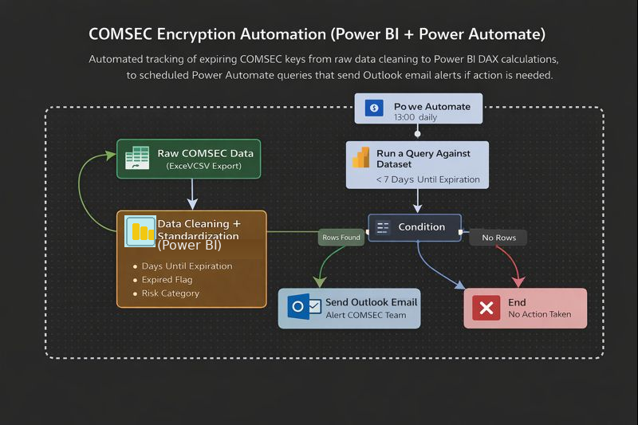

# COMSEC Encryption Automation (Power BI + Power Automate)

This project is an **automated COMSEC key-expiration monitoring and alerting system** built using **Power BI** and **Power Automate**. It takes raw COMSEC tracker data, cleans and standardizes it, calculates expiration risk using DAX, and then runs a scheduled query against the published Power BI dataset. If any keys are expiring within a defined threshold (ex: **≤ 7 days**), the flow automatically sends an **Outlook email alert**—no manual checks required.

> **Purpose:** Reduce expired/at-risk COMSEC keys by turning the tracker into an automated, repeatable alert workflow that supports continuity, readiness, and leadership visibility.

---

## Features



### **1. Raw Data → Clean Data (Power Query)**
- Imports COMSEC tracker data (Excel/CSV export).
- Standardizes column types (especially **EXPIRE DATE**).
- Removes inconsistencies (nulls/format issues) to ensure reliable automation.

### **2. Power BI Expiration Intelligence (DAX)**
- **Days Until Expiration** (date math from TODAY())  
- **Expired Flag** (Expired vs Active)  
- **Risk Category** (Expired / High / Medium / Low)

### **3. Power Automate Scheduled Monitoring**
- Runs on a daily **Recurrence schedule** (ex: 1500 HST).
- Executes **Run a query against a dataset** using DAX to pull only at-risk rows.

### **4. Automatic Outlook Email Alert**
- Uses a **Condition** to check whether any at-risk keys were returned.
- If **True**, sends an email notification with action required.
- If **False**, sends nothing (reduces inbox noise).

---

## How It Works (Workflow Overview)

1. **Raw COMSEC Data (Excel/CSV Export)** – initial tracker data source.  
2. **Data Cleaning + Standardization (Power Query)** – prepares data for accurate calculations and automation.  
3. **Power BI Model + DAX Calculations** – creates expiration metrics and risk labels.  
4. **Publish to Power BI Service** – creates the dataset used by automation.  
5. **Power Automate Recurrence** – runs the workflow on schedule.  
6. **Run a Query Against a Dataset** – filters keys expiring within threshold (ex: ≤ 7 days).  
7. **Condition** – checks if the query returned rows.  
8. **Outlook Email** – sends alert if action is required.

---

## Key Components

| Component | Purpose |
|----------|---------|
| **Raw Excel/CSV Export** | Source COMSEC tracker data |
| **Power Query** | Clean + standardize data types/format |
| **Power BI Dataset** | Hosts the model + calculations |
| **DAX Calculations** | Days Until Expiration, Expired Flag, Risk Category |
| **Power Automate (Recurrence)** | Schedules daily automation runs |
| **Run a query against a dataset** | Pulls only at-risk keys from the dataset |
| **Condition** | Only emails when results exist |
| **Outlook (Send email V2)** | Sends the final alert |

---

## Screenshots

### Power Automate – Recurrence Schedule


### Power Automate – Run a Query Against a Dataset (DAX Filter)
%20Run%20a%20query%20against%20a%20Dataset%20-POWER%20BI.png)

### Power Automate – Condition Expression (Only Email if Rows Exist)
  


### Power BI – Days Until Expiration


### Power BI – Expired Flag


### Power BI – Risk Category


### Power BI – Report Visuals / Dashboard View


---

## Output

### Outlook Email Alert (Action Required)


---

## Power BI and Power Automate: DAX Calculations + Dataset Query + Condition Logic

```DAX
Days Until Expiration =
DATEDIFF(TODAY(), 'HHC COMSEC'[EXPIRE DATE], DAY)

Expired Flag =
IF([Days Until Expiration] <= 0, "Expired", "Active")

Risk Category =
IF([Days Until Expiration] <= 0, "Expired",
IF([Days Until Expiration] <= 10, "High Risk",
IF([Days Until Expiration] <= 20, "Medium Risk",
IF([Days Until Expiration] <= 30, "Low Risk",
IF([Days Until Expiration] <= 180, "Low Risk")))))

Query example = 
EVALUATE
FILTER(
  'HHC COMSEC',
  'HHC COMSEC'[Days Until Expiration] <= 7
)

Conditional Expression = 
length(body('Run_a_query_against_a_dataset')?['FirstTableRows']) is greater than 0


